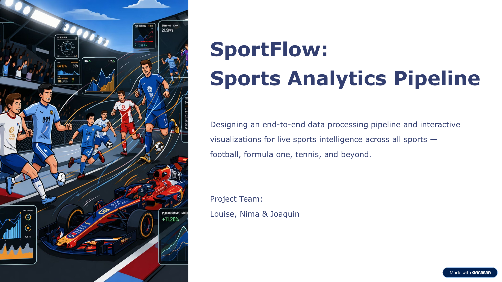
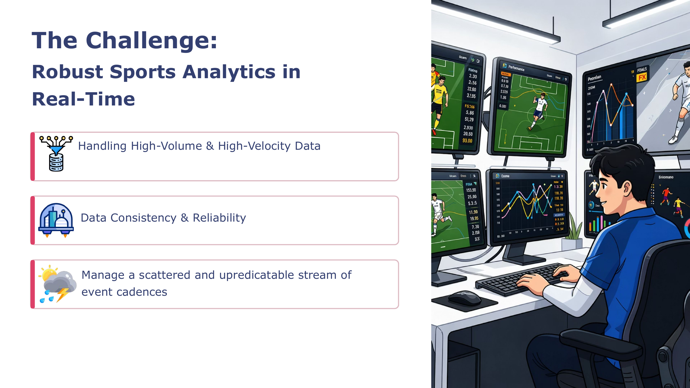
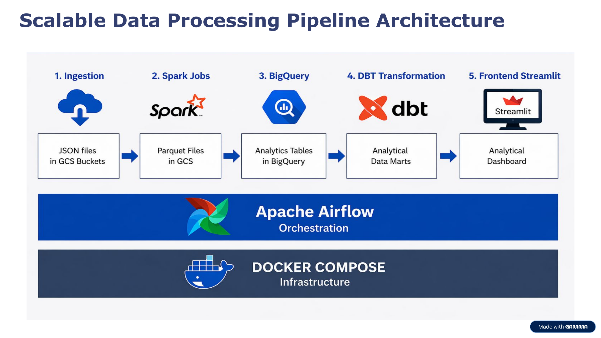
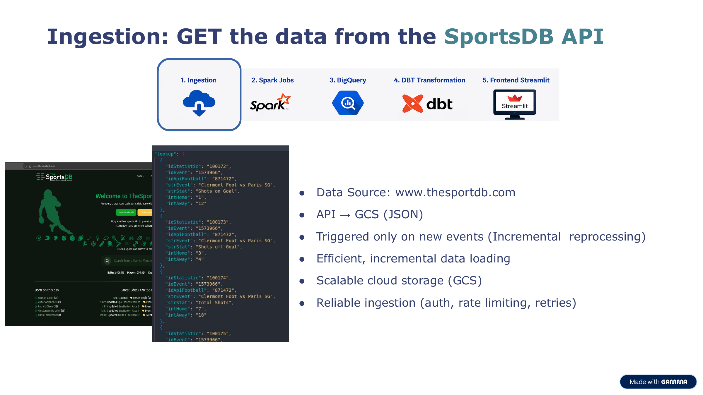
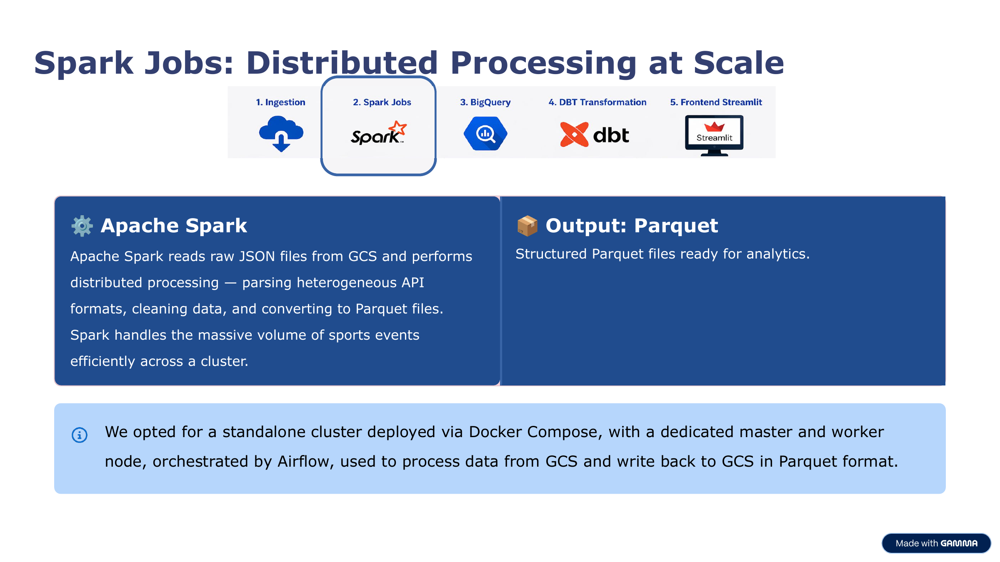
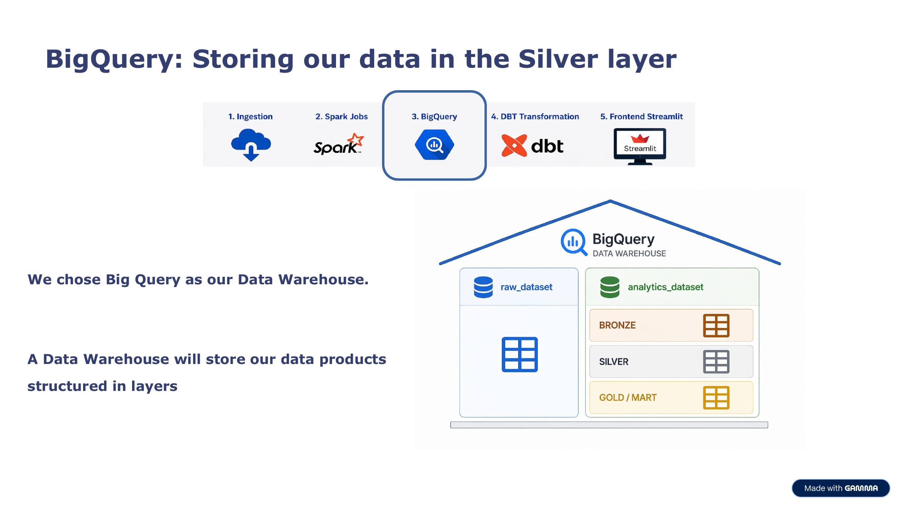
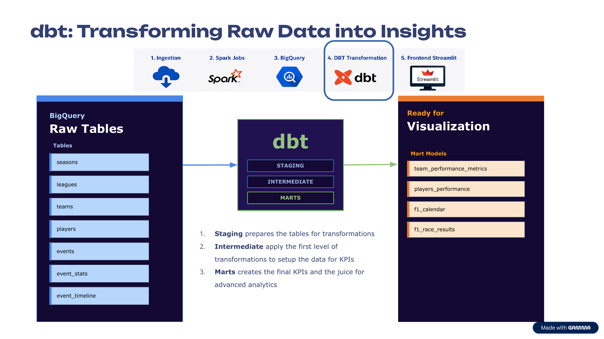
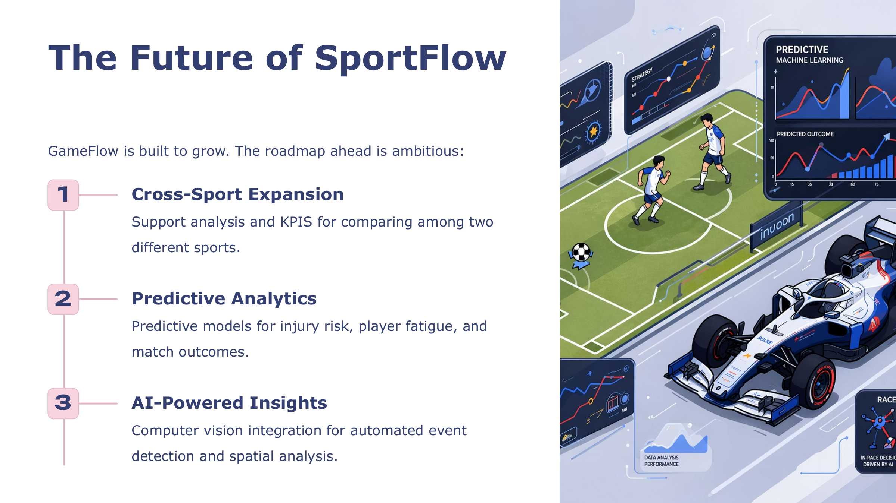

# GameFlow-Analytics-Backend

# SportFlow: Sports Analytics Pipeline

Designing an end-to-end data processing pipeline and interactive visualizations for live sports intelligence across all sports — football, formula one, tennis, and beyond.

**Project Team:** Louise, Nima & Joaquin

---

## Table of Contents

- [The Challenge](#the-challenge)
- [Architecture](#architecture)
  - [1. Ingestion](#1-ingestion)
  - [2. Spark Jobs](#2-spark-jobs)
  - [3. BigQuery](#3-bigquery)
  - [4. dbt Transformation](#4-dbt-transformation)
  - [5. Frontend (Streamlit)](#5-frontend-streamlit)
- [Demo](#demo)
- [Results: The Challenge Solved](#results-the-challenge-solved)
- [Roadmap](#roadmap)

---

## The Challenge

**Robust Sports Analytics in Real-Time**

- Handling High-Volume & High-Velocity Data
- Data Consistency & Reliability
- Managing a scattered and unpredictable stream of event cadences

---

## Architecture

SportFlow is built as a five-stage, scalable data pipeline: raw JSON is ingested from the SportsDB API, processed at scale with Apache Spark, warehoused in BigQuery, transformed into analytical marts with dbt, and finally served through an interactive Streamlit dashboard. The whole pipeline is orchestrated with **Apache Airflow** and runs on **Docker Compose** infrastructure.

### 1. Ingestion

**GET the data from the SportsDB API**

- Data Source: [www.thesportdb.com](https://www.thesportdb.com)
- Flow: API → GCS (JSON)
- Triggered only on new events (incremental reprocessing)
- Efficient, incremental data loading
- Scalable cloud storage (GCS)
- Reliable ingestion (auth, rate limiting, retries)

### 2. Spark Jobs

**Distributed Processing at Scale**

Apache Spark reads raw JSON files from GCS and performs distributed processing — parsing heterogeneous API formats, cleaning data, and converting them to Parquet files. Spark handles the massive volume of sports events efficiently across a cluster.

**Output:** structured Parquet files ready for analytics.

> We opted for a standalone cluster deployed via Docker Compose, with a dedicated master and worker node, orchestrated by Airflow, used to process data from GCS and write back to GCS in Parquet format.

### 3. BigQuery

**Storing our data in the Silver layer**

We chose BigQuery as our Data Warehouse. It stores our data products structured in layers using a **Medallion architecture**:

- `raw_dataset` — untransformed source tables
- `analytics_dataset`
  - **Bronze** — raw ingested tables
  - **Silver** — cleaned, standardized tables
  - **Gold / Mart** — final, analysis-ready KPI tables

### 4. dbt Transformation

**Transforming Raw Data into Insights**

dbt takes BigQuery raw tables and transforms them into clean, tested analytical models across three layers:

1. **Staging** — prepares the raw tables for transformation
2. **Intermediate** — applies the first level of transformations to set up the data for KPIs
3. **Marts** — creates the final KPIs and the "juice" for advanced analytics

**Raw tables:** `seasons`, `leagues`, `teams`, `players`, `events`, `event_stats`, `event_timeline`

**Mart models:** `team_performance_metrics`, `players_performance`, `f1_calendar`, `f1_race_results`

Key mart-level metrics include:

- **Team Efficiency Metrics** — compares team performance in each match across attack, passing, defense, discipline, possession, and result, whether playing home or away, giving a clear view of both match outcome and underlying performance.
- **Players Performance** — surfaces key match events by team, player, and minute, including goals, cards, substitutions, penalties, and assists, to quickly understand how the game unfolded.
- **Medallion Architecture** — organizes the data into the three layers described above: staging, intermediate, and marts.

### 5. Frontend (Streamlit)

**Real-Time Sports Dashboards**

Interactive Streamlit dashboards show player efficiency, home vs. away performance, team momentum, and cross-season comparisons — all powered by the transformed data from the pipeline above.

---

## Demo

**See SportFlow in Action** — the `GameFlow Analytics` dashboard, running locally with Streamlit, gives an overview of both Football and Formula 1 analytics from a single sidebar-driven app.

---

## Results: The Challenge Solved

**Handling Massive Sports API Data**

- **Multi-Format Ingestion** — APIs from different sports (football, basketball, etc.) have different schemas; the pipeline normalizes them all.
- **Distributed Processing** — Spark handles thousands of events per sport across a cluster, not a single machine.
- **Real-Time Analytics** — from raw API data to interactive dashboards in minutes, not hours.

> Our pipeline processes 10K+ events per match day, transforms them through Spark and BigQuery, and delivers insights to coaches within seconds of match events occurring.

---

## Roadmap

**The Future of SportFlow** — GameFlow is built to grow, and the roadmap ahead is ambitious:

1. **Cross-Sport Expansion** — support analysis and KPIs for comparing across two different sports.
2. **Predictive Analytics** — predictive models for injury risk, player fatigue, and match outcomes.
3. **AI-Powered Insights** — computer vision integration for automated event detection and spatial analysis.

---

## Tech Stack

| Layer | Technology |
|---|---|
| Ingestion | SportsDB API → Google Cloud Storage (JSON) |
| Processing | Apache Spark (Docker Compose standalone cluster) |
| Warehouse | Google BigQuery (raw / bronze / silver / gold-mart layers) |
| Transformation | dbt (staging → intermediate → marts) |
| Orchestration | Apache Airflow |
| Infrastructure | Docker Compose |
| Frontend | Streamlit |

---

## Project Team

Louise, Nima & Joaquin
